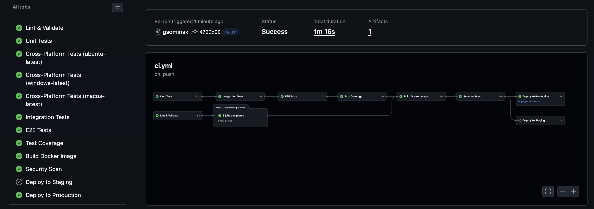

# Job Monitoring System

Cross-platform job monitoring system with process management, retry logic, and statistical analysis.

## Features

- **Job Submission & Execution**: Submit jobs via REST API, automatically execute as cross-platform processes.
- **Retry Logic**: Automatic retry on failure with configurable delay (default: 500ms, 1 retry).
- **Concurrency Control**: Async queue-based system with configurable limits (default: 100 concurrent jobs).
- **Statistical Analysis**: 7 distinct pattern analyzers for deep job execution insights.
- **Cross-Platform**: Works on Windows (.bat) and Unix-like systems (.sh).
- **Production-Ready**: Docker integration, structured logging, multi-stage CI/CD pipeline, graceful shutdown.
- **Minimal Dependencies**: Requires only Express.js and UUID in production.

## System Architecture

```text
┌───────────────────────────────────────────────────────────────────────┐
│                              CLIENT LAYER                             │
│  (curl, Postman, test scripts, external applications)                 │
└───────────────────────────────┬───────────────────────────────────────┘
                                │ HTTP/JSON
┌───────────────────────────────▼───────────────────────────────────────┐
│                           REST API LAYER                              │
│  ┌─────────────────────────────────────────────────────────────────┐  │
│  │  POST /jobs        GET /jobs         GET /stats                 │  │
│  │  ───────────       ────────────      ────────────               │  │
│  │  Create & start    List all jobs    Analyze patterns            │  │
│  └─────────────────────────────────────────────────────────────────┘  │
└───────────────────────────────┬───────────────────────────────────────┘
                                │ Function calls
┌───────────────────────────────▼───────────────────────────────────────┐
│                         CORE DOMAIN LAYER                             │
│  ┌────────────────────────────────────────────────────────────────┐   │
│  │                       JOB MANAGER                              │   │
│  │  • Central orchestrator for job lifecycle                      │   │
│  │  • In-memory state: Map<jobId, Job>                            │   │
│  └─────┬──────────────────────────┬──────────────────────┬────────┘   │
│  ┌─────▼──────────┐   ┌───────────▼─────────┐   ┌───────▼─────────┐   │
│  │ PROCESS SPAWNER│   │ STATISTICS ENGINE   │   │ LOGGER          │   │
│  │ • Cross-plat.  │   │ • 7 pattern analyzes│   │ • JSON/pretty   │   │
│  └─────┬──────────┘   └─────────────────────┘   └─────────────────┘   │
└────────┼──────────────────────────────────────────────────────────────┘
         │ spawn() / exec()
┌────────▼──────────────────────────────────────────────────────────────┐
│                      OPERATING SYSTEM LAYER                           │
│  ┌─────────────┐  ┌─────────────┐  ┌─────────────┐  ┌────────────┐    │
│  │ dummy-job   │  │ dummy-job   │  │ dummy-job   │  │ (up to 100)│    │
│  │ PID: 12345  │  │ PID: 12346  │  │ PID: 12347  │  │            │    │
│  └─────────────┘  └─────────────┘  └─────────────┘  └────────────┘    │
└───────────────────────────────────────────────────────────────────────┘
```

## Quick Start

### 1. Local Native Deployment
Requires Node.js ≥ 18.0.0.

```bash
# Clone repository
git clone <repository-url>
cd job-monitoring-system-nodejs

# Install dependencies
npm install

# Setup environment
cp .env.example .env

# Start Server (Development)
npm run dev

# Start Server (Production)
npm start
```
Server starts on `http://localhost:3000`.

### 2. Docker Deployment
```bash
# Start production environment in background
docker-compose up -d

# Verify deployment health
curl http://localhost:3000/health

# View Logs
docker-compose logs -f app
```

## Environment Configuration
Set via `.env` file or direct environment variables:

| Variable | Default | Description |
|---|---|---|
| `PORT` | `3000` | HTTP Server Port |
| `NODE_ENV` | `development` | `production` enables JSON logs |
| `MAX_CONCURRENT_JOBS` | `100` | Maximum simultaneous jobs |
| `RETRY_DELAY_MS` | `500` | Delay before retry (milliseconds) |
| `MAX_RETRIES` | `1` | Retry attempts per job |
| `LOG_LEVEL` | `info` | Logs verbosity (`silent`\|`error`\|`warn`\|`info`\|`debug`) |

## Deployment Options & CI/CD

This application is ready to be deployed on multiple cloud architectures.
- **Docker/Docker Compose**: Pre-configured via `Dockerfile` and `docker-compose.yml`.
- **Kubernetes**: Manifests available in the `/k8s/` directory (includes Deployment, NodePort/LoadBalancer).
- **Railway & Render**: Native support due to the standardized `package.json` entry points and Docker integrations.

**Built-In GitHub Actions CI/CD Pipeline:**
The repository ships with an enterprise-grade Action pipeline covering:
1. **Lint & Validation**: Pre-flight syntax validation and `npm audit`.
2. **Automated Testing Suite**: Unit, Integration, and E2E Tests spanning Ubuntu, Windows, and macOS concurrently.
3. **Security Scan**: `trivy` scans on the Docker layers.
4. **Deploy & Smoke Tests**: Auto-deployment triggered on `main`/`develop` pushes.

**Monitoring & Observability:**
We expose two crucial endpoints for operational monitoring:
- `GET /health` (`status`, `uptime`, `timestamp`)
- `GET /stats` (For failure rates and queue backlogs)

## API Reference

### POST /jobs
Submit a new job for execution.

**Request:**
```json
{
  "jobName": "critical-payment-processor",
  "arguments": ["--fast", "--quality", "high"]
}
```

**Response (201 Created):**
```json
{
  "id": "550e8400-e29b-41d4-a716-446655440000",
  "jobName": "critical-payment-processor",
  "arguments": ["--fast", "--quality", "high"],
  "status": "queued",
  "pid": null,
  "exitCode": null,
  "retryCount": 0,
  "submittedAt": "2024-01-01T12:00:00.000Z"
}
```

### GET /jobs
List all jobs.

**Response (200 OK):**
```json
{
  "total": 42,
  "jobs": [
    {
      "id": "...",
      "jobName": "...",
      "status": "completed"
    }
  ],
  "summary": {
    "running": 10,
    "completed": 20,
    "failed": 2
  }
}
```

### GET /stats
Get statistical analysis of all jobs. Extracts runtime insights via deeply integrated pattern modules.

**Response (200 OK):**
```json
{
  "totalJobs": 100,
  "patterns": [
    {
      "category": "naming",
      "pattern": "Job name starts with 'critical-'",
      "successRate": 0.92,
      "differenceFromBaseline": "+0.20",
      "percentageImprovement": "+27.8%",
      "insight": "Jobs with 'critical-' show 28% higher success rate"
    }
  ]
}
```

#### Statistical Patterns Explained
1. **Name Prefix**: Jobs grouped by naming convention (`critical-`, `batch-`, `test-`)
2. **Argument Flags**: Usage frequency of specific flags (`--fast`, `--quality`, `--debug`)
3. **Burst Submissions**: Periods with >5 jobs submitted within 10 seconds
4. **Duration Correlation**: Average execution time for successful vs failed jobs
5. **Retry Correlation**: Success rates for jobs that required retry vs those that didn't
6. **PID Parity**: Distribution of even vs odd process IDs (exotic pattern)
7. **Warmup Effect**: Success rate comparison of first 10 jobs vs remaining (exotic pattern)

## Data Flows

### Job Submission Flow
```text
┌─────────┐     ┌─────────┐     ┌─────────────┐     ┌─────────────┐       ┌────┐
│ Client  │     │   API   │     │ Job Manager │     │  Process    │       │ OS │
│         │     │         │     │             │     │  Spawner    │       │    │
└────┬────┘     └────┬────┘     └──────┬──────┘     └──────┬──────┘       └─┬──┘
     │ POST /jobs    │                 │                   │                │
     ├──────────────>│                 │                   │                │
     │               │ validate()      │                   │                │
     │               │ submitJob()     │                   │                │
     │               ├────────────────>│                   │                │
     │               │                 │ check concurrency │                │
     │               │                 │ spawn(job)        │                │
     │               │                 ├──────────────────>│                │
     │               │                 │                   │ spawn()        │
     │               │                 │                   ├───────────────>│
     │               │                 │                   │   dummy-job    │
     │               │                 │ childProcess      │<───────────────┤
     │               │                 │<──────────────────┤                │
     │               │ job metadata    │                   │                │
     │               │<────────────────┤                   │                │
     │ 201 Created   │                 │                   │                │
     │<──────────────┤                 │                   │                │
```

### Job Completion & Retry Flow
```text
┌────┐     ┌─────────────┐     ┌─────────────┐      ┌────────┐
│ OS │     │  Process    │     │ Job Manager │      │ Queue  │
│    │     │  Spawner    │     │             │      │        │
└─┬──┘     └──────┬──────┘     └──────┬──────┘      └───┬────┘
  │ exit(1)       │                   │                 │
  ├──────────────>│ 'exit' event      │                 │
  │               ├──────────────────>│                 │
  │               │                   │ update job      │
  │               │                   │ if retry < 1    │
  │               │                   │ scheduleRetry() │
  │               │                   │ setTimeout(Wait)│
  │               │                   │ startJob()      │
  │               │ spawn()           ├─────────┐       │
  │               │<──────────────────┤ (retry) │       │
  │ new process   │                   │<────────┘       │
  │<──────────────┤                   │                 │
  │ exit(0)       │                   │                 │
  ├──────────────>│ 'exit' event      │                 │
  │               ├──────────────────>│                 │
  │               │                   │ mark success    │
  │               │                   │ processQueue()  │
  │               │                   ├────────────────>│
  │               │                   │ next job pop    │
  │               │                   │<────────────────┤
```

## Project Structure

```text
job-monitoring-system/
├── src/
│   ├── api/              # REST API layer (App setup & Express Routes)
│   ├── core/             # Business logic (JobManager, ProcessSpawner, Pattern Analysis)
│   ├── utils/            # Utilities (Structured Logger, Config)
│   └── index.js          # Entry point
├── scripts/
│   ├── dummy.sh          # Unix dummy payload process
│   ├── dummy.bat         # Windows dummy payload process
│   └── seed.js           # Test data generator (HTTP Loader)
├── tests/
│   ├── unit/             # Core logic assertions
│   ├── integration/      # Express API bounds testing
│   └── e2e/              # Full Job lifecycle testing
└── .specs/               # Full specification documents & architecture designs
```

## Known Limitations (MVP)

This system is built as a Minimum Viable Product. To reduce complexity, certain features were explicitly marked as "Out of Scope" by design. This includes:
- **No persistent storage**: Jobs are logically stored in-memory and will be lost on server restart.
- **No job cancellation**: Active running jobs cannot be killed manually via the API.
- **No stdout/stderr capture**: Text outputs from dummy processes are not collected.
- **Single-instance only**: Distributed clustering, Priority queues, and User Auth are omitted.

For a comprehensive list of all technical constraints and architecture trade-offs, please refer to the detailed specification:
- [Implementation Plan Constraints](.specs/IMPLEMENTATION_PLAN.md#L902)
- [System Specification (Out of Scope)](.specs/features/job-monitoring-system/spec.md#L635)

## Testing & Development

### Live Demonstration
We provide a comprehensive demonstration script (`demo.sh`) that tests the entire system automatically.
It runs the automated test suites, validates API health, subjects the process manager to burst submissions, seeds randomized HTTP payload generation, and aggregates statistical parameters fully natively.

To run the live evaluation pipeline:
```bash
# Terminal 1: Start the Local Network
npm start

# Terminal 2: Run full system demo
./demo.sh
```

### Run Tests

```bash
# All tests (Unit, Integration, E2E)
npm test

# Generate a unified coverage report
npm run test:coverage
```

### Seed Test Data
Need data to visualize?
```bash
# Generate 50 randomized test jobs
npm run seed

# Custom amount generator
JOBS_COUNT=100 npm run seed
```



## License
MIT

## Author
gsominsk

